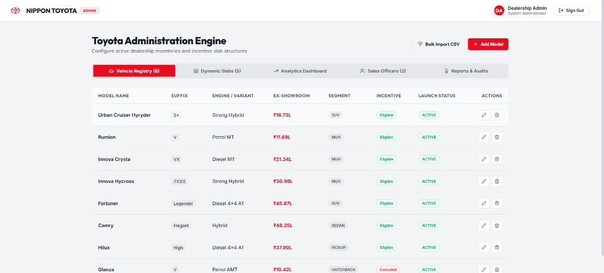
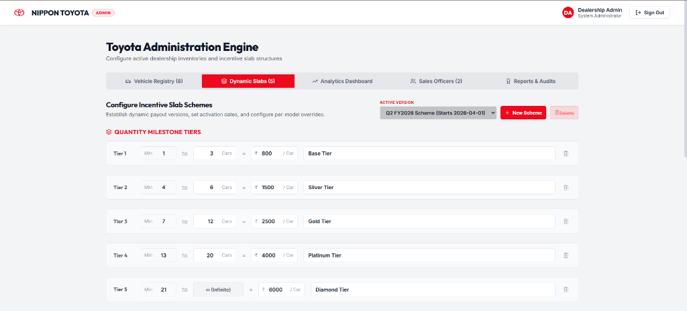
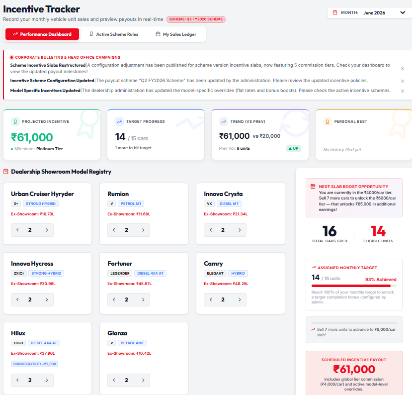

# Toyota Dealer Incentive Engine (DMS)

**Live Demo:** [https://assignment-toyota.vercel.app/](https://assignment-toyota.vercel.app/)

A  dealer management portal to track car sales, calculate sales officer incentives, manage showroom inventory, and handle monthly targets.

---

## Dashboard Previews

### 🏛️ Showroom Vehicle Registry (Admin View)


### ⚙️ Dynamic Incentive Slabs & Overrides (Admin View)


### 📊 Personal Sales Incentive Tracker (Sales Officer View)


---

## How to Run Locally

### 1. Prerequisites
* [Node.js (v18+)](https://nodejs.org/)
* A [Supabase](https://supabase.com) PostgreSQL database

### 2. Backend Setup
1. Go to the `server/` directory:
   ```bash
   cd server
   ```
2. Install dependencies:
   ```bash
   npm install
   ```
3. Create a `.env` file in the `server/` directory with:
   ```env
   PORT=3000
   SUPABASE_URL=your_supabase_url
   SUPABASE_KEY=your_supabase_service_role_key
   JWT_SECRET=any_secret_key_for_jwt
   ```
4. Run the queries in the root `schema.sql` in your Supabase SQL editor to create the tables and insert mock data.
5. Start the server:
   ```bash
   npm run dev
   ```

### 3. Frontend Setup
1. Go to the root directory and install dependencies:
   ```bash
   npm install
   ```
2. Start the Angular application:
   ```bash
   npx ng serve
   ```
3. Open `http://localhost:4200` in your browser.

*Note: The frontend is set up to talk to the Vercel backend (`https://assignment-toyota-backend.vercel.app/api`) by default. If you want to use your local server, update the API base URLs in `src/app/services/database.service.ts` and `src/app/services/auth.service.ts`.*

---

## Test Accounts

| Role | Username | Password | Can test... |
| :--- | :--- | :--- | :--- |
| **Admin** | `admin` | `admin123` | Managing cars, incentive slabs, assigning targets, and overrides. |
| **Sales Officer** | `officer1` | `sales123` | Submitting monthly sales (Rahul Sharma), checking target progress, reading announcements, and viewing earnings. |
| **Sales Officer** | `officer2` | `sales123` | Logging sales and viewing ledger (Priya Patel). |

---

## Incentive Rules & Logic

1. **Volume Slabs (Base rate per car):**
   * **Tier 1 (1–3 cars):** ₹800 / car (Base Tier)
   * **Tier 2 (4–6 cars):** ₹1,500 / car (Silver Tier)
   * **Tier 3 (7–12 cars):** ₹2,500 / car (Gold Tier)
   * **Tier 4 (13–20 cars):** ₹4,000 / car (Platinum Tier)
   * **Tier 5 (21+ cars):** ₹6,000 / car (Diamond Tier)

2. **Model Overrides:**
   * **Bonus Override:** Adds a bonus boost on top of the base slab rate (e.g. Hilux adds a bonus of **+₹2,500 / car**).
   * **Excluded Models:** Certain entry-level models do not earn incentives and are excluded from the eligible units count (e.g. Glanza is **Excluded**).

### Math Example (June 2026 Logs):
If a Sales Officer sells **16 cars** in a month:
* 2 x Urban Cruiser Hyryder, 2 x Rumion, 2 x Innova Crysta, 2 x Innova Hycross, 2 x Fortuner, 2 x Camry, 2 x Hilux (14 eligible units)
* 2 x Glanza (Excluded model = 0 eligible units)

**Calculations:**
1. **Eligible Volume:** 14 units (excluding the 2 Glanzas).
2. **Slab Tier Achieved:** 14 units falls into **Tier 4 (13–20 cars)**, setting the base rate to **₹4,000 / car**.
3. **Base Commission:** 14 eligible units * ₹4,000 = **₹56,000**
4. **Model Bonus (Hilux):** 2 Hilux units * ₹2,500 bonus override = **₹5,000**

**Total Incentive Payout:** ₹56,000 + ₹5,000 = **₹61,000**